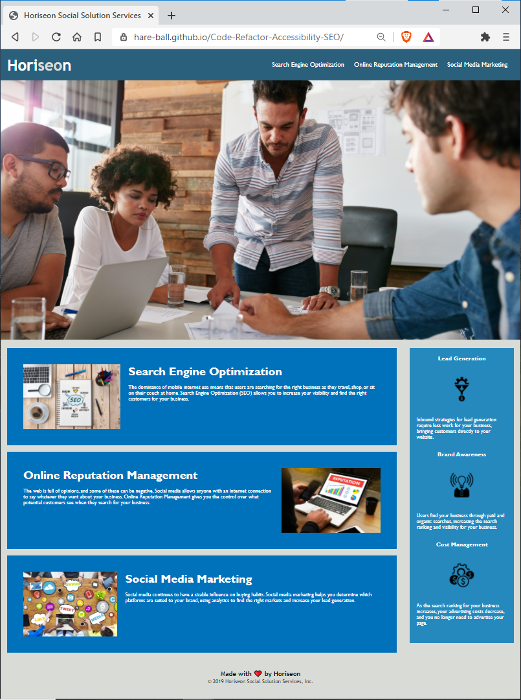

# Code-Refactor-Accessibility-SEO

The Horiseon Website has been refactored to match semantic language. I replaced the "divs" with more specific langauge. I also added alternative text to go along with the images to meet accesibility requirements. The CSS has been adjusted to match the new semantic language changes.

Here is the link to the deployed site: insert link https://hare-ball.github.io/Code-Refactor-Accessibility-SEO/

